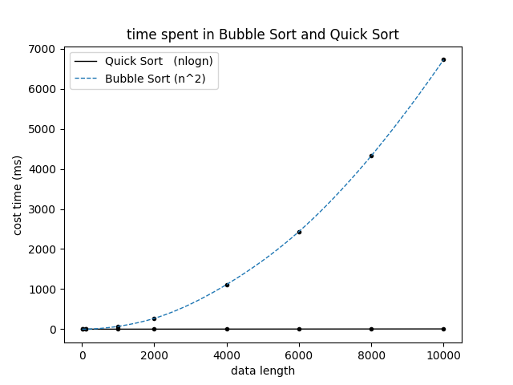
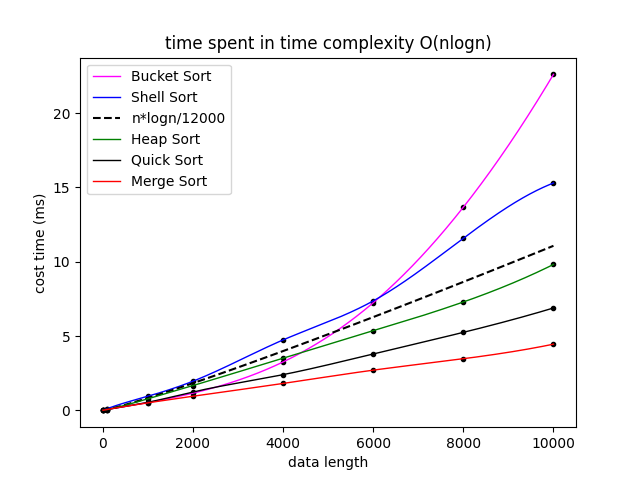

# The Soul of Program

-----

>  Author:
>
>  [@Hongbo Wang ](https://github.com/BOBWang1117)
>
>  
>
>  

## **Environment:**

- Microsoft Visual Studio

  

## **Details**

- Type: summer program

- Teacher: Venkatesan Guruswami (Carnegie Mellon University)

- Computer Language: C++

- Project Name: The Soul of Program

- Time: 2020/12/31

- Description: Find out the difference in sorting speed and memory consumption by designing sorting algorithms of different complexity

## **Dependencies:** 

- None

## **Install package:**

- None

## **Run program:**

- copy the code into visual studio

  

  

 

## **Example:**

1. 

   

2. 

   

